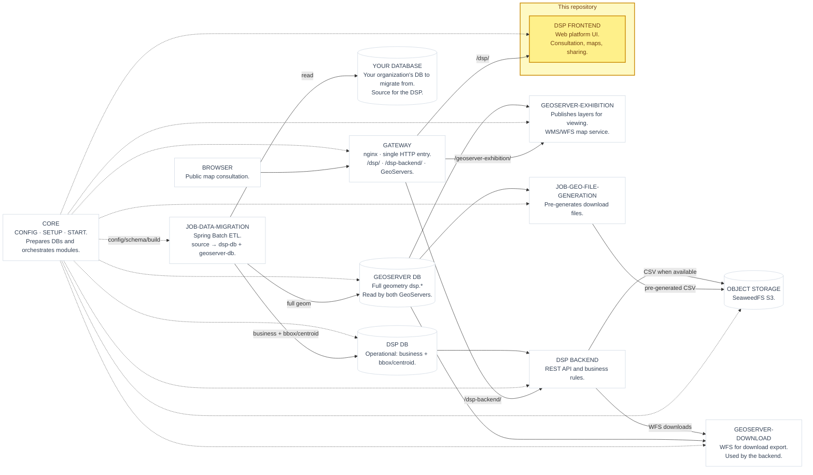

# rer-dsp-frontend

> [!IMPORTANT]
> This repository is one module of the **DSP (Data Sharing Platform)**, part of the RER ecosystem. Full project documentation lives in **[dsp-docs](https://github.com/Rural-Environmental-Registry/dsp-docs)**. The information below covers this module only, and only briefly.
>
> **[Go to the DSP documentation](https://rural-environmental-registry.github.io/dsp-docs)**

## Where this module fits in the DSP

## Purpose

Web interface for viewing and sharing rural environmental data among RER partner institutions.

## Responsibilities

- Display environmental data and maps (WMS layers)
- Consume the `rer-dsp-backend` REST API
- Provide the DSP platform user experience

## Technologies

Vue 3, Vite, TypeScript, Tailwind CSS.

## License

[GNU General Public License v3.0](LICENSE)

<small><strong>Copyright © 2026 Government of Brazil — Ministry of Management and Innovation in Public Services</strong></small>
